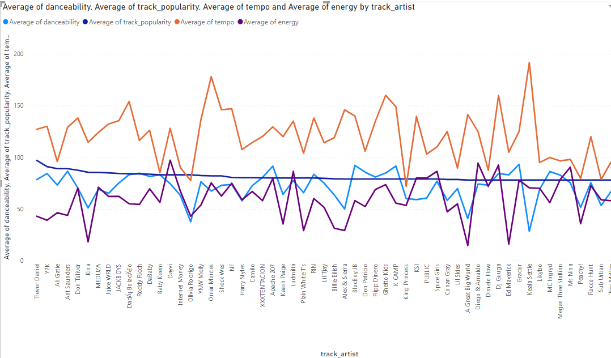
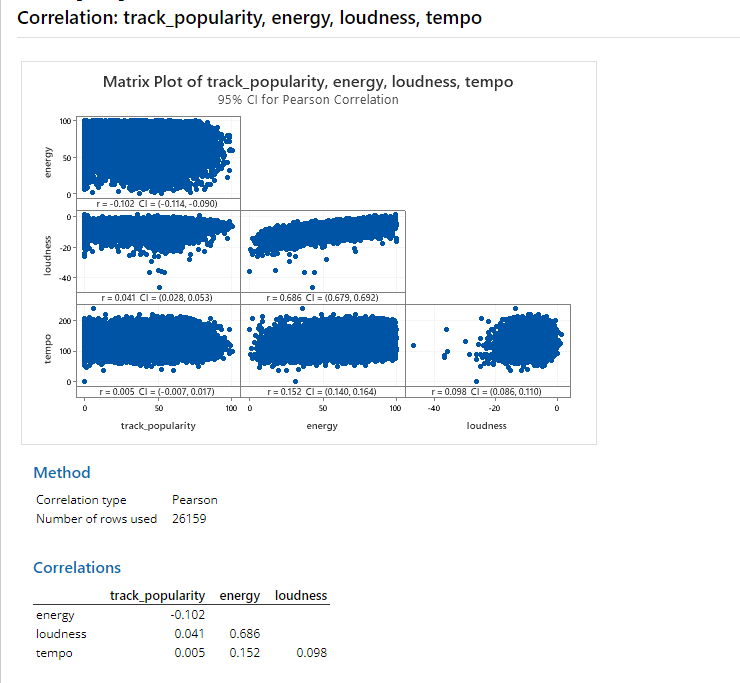
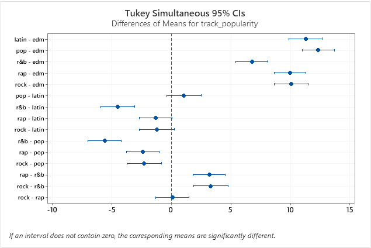
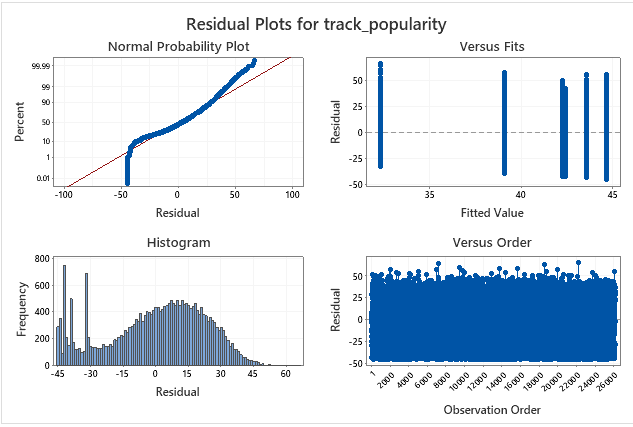
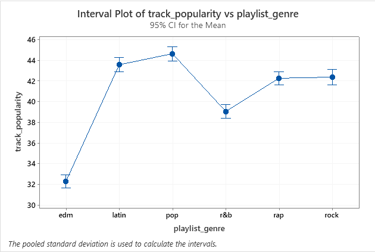
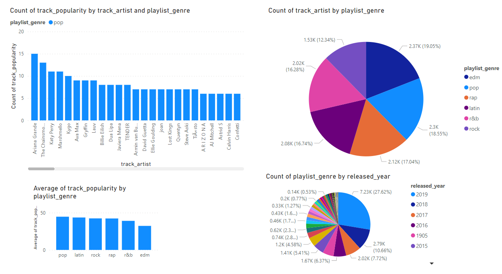

# SpotifyTrendsAnalyzer
SpotifyTrendsAnalyzer is a data analytics project focused on unraveling trends within the world of Spotify music. Explore the popularity of artists, discover trending songs, and delve into the metrics of danceability and energy. 
## Objectives 
### Artist Popularity Analysis:
Explore the popularity of each artist in the Spotify dataset.
Identify trends and variations in artist popularity over time.
### Trending Songs Analysis:
Determine which songs were trending during specific time periods.
Investigate factors contributing to the popularity of these songs.
### Artist Productivity Comparison:
Compare the number of songs created by each artist in the dataset.
Analyze the productivity of artists over different time intervals.
### Song Features Exploration:
Examine the danceability, energy, and other features of popular songs.
Uncover patterns and correlations between song features and popularity.

## Analysis Steps

### 1. Prepare

- **Import Dataset:**
  - The dataset used in this project was obtained from Kaggle, a platform known for high-quality datasets. (https://www.kaggle.com/datasets/joebeachcapital/30000-spotify-songs?resource=download)
  - Data has been validated to ensure accuracy and reliability.
  - Since the dataset originates from Spotify via Kaggle, we can trust its authenticity, and steps have been taken to confirm the data's validity.
  - The original dataset was initially available in CSV format.
  - Due to compatibility considerations with Microsoft SQL Server Studio, the dataset was converted to Excel format for ease of import.
- **Data Exploration:**
  - Use SQL queries to understand the structure of the data.
  - Identify potential areas of interest.

- **Excel Format for SQL Server:**
  - Excel format facilitates a smoother import process into Microsoft SQL Server Studio.
  - The dataset in Excel format is more conducive to SQL operations and analysis.

- **Data Validation:**
  - Before conversion, the integrity of the dataset was validated to ensure accurate representation after the format change.

### 2. Process

#### Data Cleaning -Removing Duplicates

To ensure data quality and eliminate duplicate entries, I performed a cleaning step to identify and retain only the most popular tracks within each group of duplicates. The following SQL query was used:

```sql
--Find duplications from the dataset 
SELECT track_name, track_artist, COUNT(*) as duplications 
FROM spotify_songs$
GROUP BY track_name, track_artist
HAVING COUNT(*) > 1
order by duplications desc;
```


#### Data Cleaning - Remove  Duplicates and Select Relevant Fields

It will be easy if we converted some fields in to some appropriate formats. For future analysis we need to have some varience of each of values. Otherwise it will be difficult to identify significance of data when we do visualize. So 
To ensure data accuracy and streamline the dataset for analysis, a data cleaning step was performed. The following SQL query was utilized to remove duplicates and select only the relevant fields for analysis:

```sql
-- Remove duplications from the dataset and choose the required fields with appropriate modifications
WITH UniqueRows AS (
  SELECT
    track_name,
    track_artist,
    track_popularity,
	track_album_name,
	YEAR(track_album_release_date) as released_year ,
	playlist_name,
	playlist_genre,
	playlist_subgenre,
	ROUND(danceability*100,1) as danceability, --to show as percentage
	ROUND(energy*100,1) as energy,
	[key],
	ROUND(loudness,2) as loudness,
	mode,
	ROUND(speechiness*100,2) as speechiness, 
	ROUND(acousticness*100,2) as acousticness, 
	ROUND(liveness*100,2) as liveness, 
	ROUND(valence*100,2) as valence, 
	ROUND(tempo,2) as tempo, --to keep only two decimal places 
	FORMAT(DATEADD(MILLISECOND,duration_ms,0),'mm:ss') as duration, --convert milliseconds to minutes and seconds 
    ROW_NUMBER() OVER (PARTITION BY track_name, track_artist ORDER BY track_popularity DESC) AS RowNum
  FROM
    spotify_songs$
)
SELECT
  track_name,
  track_artist,
  track_popularity,
  track_album_name,
  released_year,
  playlist_name,
  playlist_genre,
  playlist_subgenre,
  danceability,
  energy,
  [key],
  loudness,
  mode,
  speechiness,
  acousticness,
  liveness,
  valence,
  tempo,
  duration
FROM
  UniqueRows
WHERE
  RowNum = 1;
```

#### Handling Null Values

Identify and handle null values to ensure data quality. The following steps were taken:

1. **Identifying Null Values:**
  - SQL queries were executed to pinpoint rows where null values were present in specific columns.

    ```sql
    --To check which rows having null values
    select * from spotify_songs$ where track_name is null or playlist_name is null or playlist_genre is null or 
    playlist_genre is null or 
    playlist_subgenre is null or 
    danceability is null or energy is null or
    [key] is null or
    loudness is null or 
    mode is null or 
    speechiness is null or 
    acousticness is null or 
    liveness is null or 
    valence is null or 
    tempo is null or 
    duration_ms is null;
    ```

    This query helped in understanding the extent of null values across the dataset.

2. **Handling Null Values:**
   - Once identified, null values were handled appropriately based on the nature of the dataset and specific column requirements.
  

    ```sql
    --Remove row which having null value 
    delete from spotify_songs$
    where track_name is null;
    ```

  


### 3. Analysis

### Analyze Stage - Artist Characteristics
In this section, we explore the interplay between artist characteristics and song popularity. Visualizations are used to illustrate how key attributes such as danceability, energy, and overall popularity evolve across different artists.

Insights from Visual Analysis
Artist Characteristics Over Time
The line chart below depicts how artist characteristics change over time, focusing on key metrics: popularity, danceability, and energy.

```sql
--To  find how each of artist popularity relation with  average of their songs danceability,enery and tempo
select track_artist,round(avg(danceability),2) as dance_ability,round(avg(track_popularity),2) as popularity,round(avg(tempo),2) as tempo,round(avg(energy),2) as energy from spotify_songs_cleaned$
group by track_artist
order by popularity desc;

```

##### Summary of Song Characteristics Analysis

In the process of analyzing various song characteristics and their impact on popularity, several interesting patterns have emerged. Here are key insights:

###### Influence of Tempo and Energy

Despite initial expectations, the average energy and tempo of songs within an artist's portfolio show no strong correlation with the overall popularity of the artist. Even artists with lower average values for energy and tempo can have highly popular songs.

##### Danceability's Minor Impact

Contrary to tempo and energy, danceability exhibits a somewhat discernible influence on the average popularity of an artist. While it is not a decisive factor, there is a subtle connection between higher danceability and a slightly increased average popularity for some artists.

##### Holistic View of Popularity Factors

In summary, the analysis suggests that popularity, in the context of our dataset, is less reliant on specific musical attributes like tempo and energy. Instead, it appears to be influenced by a combination of factors, with danceability playing a modest role.

These insights provide a valuable perspective for understanding the dynamics of song popularity and can guide future explorations in the realm of music analytics.

##### Statistical Analysis Results

###### Insights from Correlation Analysis

###### Correlation Matrix Overview

- **Correlation Type:** Pearson
- **Number of Rows Used:** 26,159

###### Correlations:

|                | Track Popularity | Energy | Loudness | Tempo |
|----------------|------------------|--------|----------|-------|
| **Energy**     | -0.102           | 1      | 0.041    | 0.005 |
| **Loudness**   | 0.041            | 0.686  | 1        | 0.152 |
| **Tempo**      | 0.005            | 0.152  | 0.098    | 1     |





#### Insights:

1. **Track Popularity vs. Energy:**
   - The correlation coefficient of -0.102 suggests a weak negative correlation.
   - Interpretation: As energy levels increase, track popularity tends to slightly decrease.

2. **Track Popularity vs. Loudness:**
   - The correlation coefficient of 0.041 indicates a weak positive correlation.
   - Interpretation: There is a subtle positive relationship between track popularity and loudness.

3. **Track Popularity vs. Tempo:**
   - The correlation coefficient of 0.005 suggests a very weak positive correlation.
   - Interpretation: Tempo shows minimal impact on track popularity.

### Conclusion:

- While there are correlations observed, they are generally weak, indicating that the relationships between these variables are not very strong.
- It's essential to consider other factors and conduct further analysis to uncover additional insights.


## One-Way ANOVA with Tukey's Test: Popularity Across Playlist Genres

### Analysis Details:

- **Null Hypothesis:** All means of popularity are equal across different playlist genres.
- **Alternative Hypothesis:** Not all means are equal.
- **Significance Level:** α = 0.05

#### ANOVA Results:

- **F-Value:** 183.04
- **P-Value:** 0.000

##### Tukey's Test Pairwise Comparisons:

- **Grouping Information:**
  - Group A: pop
  - Group B: latin, rock, rap
  - Group C: r&b
  - Group D: edm


- **Significant Differences:**
  - Groups with different letters (A, B, C, D) have significantly different mean popularity.

###### Means and Standard Deviations:

- **pop:** Mean = 44.653, StDev = 23.590, 95% CI = (43.966, 45.339)
- **latin:** Mean = 43.581, StDev = 23.428, 95% CI = (42.876, 44.287)
- **rock:** Mean = 42.384, StDev = 23.547, 95% CI = (41.656, 43.112)
- **rap:** Mean = 42.274, StDev = 21.982, 95% CI = (41.641, 42.908)
- **r&b:** Mean = 39.066, StDev = 23.807, 95% CI = (38.383, 39.749)
- **edm:** Mean = 32.288, StDev = 20.904, 95% CI = (31.645, 32.930)




#### Conclusion:

1. **ANOVA Results:**
   - The one-way ANOVA indicates a statistically significant difference in mean popularity across different playlist genres.

2. **Tukey's Test:**
   - Tukey's test identifies specific groups with significantly different mean popularity.
   - Groups A, B, C, and D have distinct mean popularity levels.


### 4. Share


In the Share phase of the Spotify Trends Analyzer project, we explored various aspects of the dataset to uncover insights related to artist popularity, playlist genres, and song release years.



#### Top Artist Analysis
##### 1. Top Artist in Pop Genre
- Visualization: Explored the popularity trend of pop songs' artists.

- Insight: Identified Ariana Grande as a leading artist within the pop genre.

#### Genre Popularity Analysis
##### 2. Genre Popularity Distribution
- Visualization: Created a histogram depicting the popularity distribution across different genres.

- Insight: Revealed that pop and latin genres have higher average popularity compared to other genres.

#### Distribution of Playlist Genres
##### 3. Playlist Genres Distribution
- Visualization: Utilized a pie chart to illustrate the distribution of artists across different playlist genres.

-Insight: Discovered that a significant portion of artists creates playlists as a genre, followed by pop songs.

#### Song Release Years
##### 4. Song Release Years Distribution
- Visualization: Developed a pie chart showcasing the percentage of songs released in specific years.

- Insight: Found that the dataset primarily includes songs released in recent years (2019, 2018, 2017, 2016), indicating a focus on modern music.


_These visualizations provide a comprehensive overview of the Spotify dataset, highlighting trends in artist popularity, genre preferences, and the temporal distribution of songs. Stakeholders can easily grasp these insights through the accompanying screenshots._